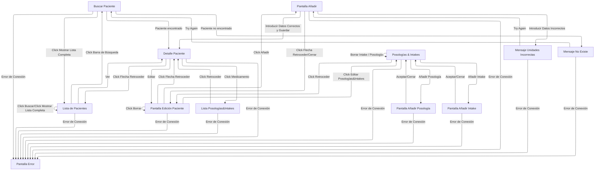

```mermaid
---
config:
  layout: elk
---
flowchart TD
    A["Lista de Pacientes"] -- Ver --> B["Detalle Paciente"]
    A -- Click Barra de Búsqueda --> F["Buscar Paciente"]
    A -- Click Buscar/Click Mostrar Lista Completa --> A
    B -- Editar --> C["Pantalla Edición Paciente"]
    B -- Click Flecha Retroceder --> A
    B -- Click Medicamento --> L["Lista Posologías&Intakes"]
    C -- Click Borrar --> C
    C -- Click Añadir --> D["Pantalla Añadir"]
    C -- Click Flecha Retroceder --> B
    C -- Click Editar Posologías&Intakes --> I["Posologías & Intakes"]
    D -- Introducir Datos Correctos y Guardar --> B
    D -- Introducir Datos Incorrectos --> E["Mensaje Unidades Incorrectas"]
    D -- Click Flecha Retroceder/Cerrar --> C
    E -- Try Again --> D
    F -- Paciente encontrado --> B
    F -- Click Mostrar Lista Completa --> A
    F -- Paciente no encontrado --> G["Mensaje No Existe"]
    G -- Try Again --> F
    A -- Error de Conexión -->  H["Pantalla Error"]
    B -- Error de Conexión -->  H
    C -- Error de Conexión -->  H
    D -- Error de Conexión -->  H
    E -- Error de Conexión -->  H
    F -- Error de Conexión -->  H
    G -- Error de Conexión -->  H
    I -- Error de Conexión -->  H
    J -- Error de Conexión -->  H
    K -- Error de Conexión -->  H
    L -- Error de Conexión -->  H
    I -- Añadir Posología --> J["Pantalla Añadir Posología"]
    I -- Añadir Intake --> K["Pantalla Añadir Intake"]
    I -- Borrar Intake / Posología --> I
    J -- Aceptar/Cerrar --> I
    K -- Aceptar/Cerrar --> I
    I -- Click Retroceder --> C
    L -- Click Retroceder --> B
```
