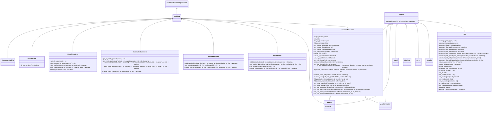

```mermaid


classDiagram
    Model.py <-- ExcepcionModelo
    Model.py <-- ServerStatus
    Model.py <-- ModeloPaciente
    Model.py <-- ModeloMedicamento
    Model.py <-- ModelPosologia
    Model.py <-- ModelIntake
    Model.py <|-- app.py
    Model.py <|-- PacientePresenter

    Base de datos de la Organizacion <-- Model.py

    View.py <|-- ViewManejador
    View.py <|-- PacientePresenter
    View.py <-- app.py
    View.py <-- GMed
    View.py <-- GPatient
    View.py <-- GPos
    View.py <-- GIntake
    View.py <-- View

    PacientePresenter <|-- app.py
    PacientePresenter <|-- ViewManejador
    

    class ExcepcionModelo
    class ServerStatus{
        +is_server_down(): Boolean
    }

    class ModeloPaciente{
        +get_all_pacientes(): list
        +get_paciente_by_query(query:str ): list
        +add_paciente(name:str, surname:str, code:str) : Boolean
        +edit_paciente(name:str, surname:str, code:str, id:int) : Boolean
        +delete_paciente(id : int): Boolean
    }

    class ModeloMedicamento{
        +get_all_meds_paciente(id:int): list
        +get_meds_paciente(idPaciente : int, idMedicamento : int) : Medicamento
        +add_meds_paciente(name : str, dosage : int, treatment_duration : int, start_date : str, patient_id : int) : Boolean
        +edit_meds_paciente(name : str, dosage : int, treatment_duration : int, start_date : str, patient_id : int) : Boolean
        +delete_meds_paciente(id : int, medication_id : int) : Boolean
    }

    class ModelPosologia{
        +add_posologia(minute : int, hour : int, patient_id : int, medication_id : int) : Boolean
        +get_posologias(patient_id : int, medication_id : int) : list
        +delete_posologias(patient_id : int, medication_id : int, posologie_id : int) : Boolean
    }

    class ModelIntake{
        +add_intake(patient_id : int, medication_id : int, date : str) : Boolean
        +get_intakes_by_patient_and_medication(patient_id : int, medication_id : int) : list
        +get_intake_patient(patient_id : int) : list
        +delete_intake(patient_id : int, medication_id : int, intake_id : int) : Boolean
    }

    class PacientePresenter{
        +run(application_id: str)  
        +init_list()  
        +list_by_query(query: str)  
        +fill_meds_list(idref: int)  
        +on_patient_selected(enfermo: GPatient)  
        +on_buscar_clicked(query: str)  
        +on_campo_modificado(query: str)  
        +on_entry_modify(guardar: Gtk.Button)  
        +volver_a_buscador()  
        +volver_a_meds(enfermo: GPatient)  
        +volver_a_edit(enfermo: GPatient)  
        +on_edit_clicked(enfermo: GPatient)  
        +delete_med(pastilla_id: int, enfermo: GPatient)  
        +on_add_clicked(enfermo: GPatient)  
        +on_add_confirmed(name: str, dosage: int, treatment_duration: int, start_date: str, enfermo: GPatient)  
        +guardar_med(pastilla: GMed, enfermo: GPatient, name: str, dosage: str, tratamient: str)  
        +mostrar_posin_edit(pastilla: GMed, chuzao: GPatient)
        +mostrar_posin(cell, path, pastilla: GMed, chuzao:GPatient)
        +fill_posologies_list(medication_id: int, enfermo_id: int)  
        +fill_intakes_list(medication_id: int, enfermo_id: int)  
        +on_borrar_posologia(posologia: GPos, enfermo: GPatient)  
        +on_borrar_intake(id: int, med_id: int, enfermo: GPatient)  
        +on_add_posologie_clicked(enfermo: GPatient, medication_id: int)  
        +on_add_posologie_confirmed(minute: str, hour: str, medication_id: int, enfermo: GPatient)  
        +on_add_intake_confirmed(enfermo: GPatient, medication_id: int, date: str)  
        +on_add_intake_clicked(enfermo: GPatient, medication_id: int)
    }

    class View{
        +mensaje_pop_up(msg : str)
        +construir_busqueda(query: str)
        +construir_ui(app : Gtk.Application)
        +construir_vista_paciente(enfermo : GPatient)
        +construir_vista_edit(enfermo : GPatient)
        +construir_vista_add(enfermo : GPatient)
        +construir_vista_posologias_intakes_edit(medication_id : int, chuzao : GPatient)
        +construir_vista_posologias_intakes(medication_id: int, chuzao: GPatient)
        +construir_vista_add_intake(enfermo : GPatient, medication_id : int)
        +construir_vista_add_posologia(enfermo : GPatient, medication_id : int)
        +volver_a_meds(enfermo : GPatient)
        +volver_a_edit(enfermo : GPatient)
        +volver_a_buscador()
        +actualize_grid_meds(patient_id : int)
        +actualize_list(query : str)
        +not_found()
        +set_intakes(intakes : list)
        +set_posologies(posologies : list)
        +set_meds(meds : list)
        +set_pacientes(pacientes : list)
        +on_activate(app : Gtk.Application)
        +set_handler(handler : ViewManejador)
        +cargando_datos()
        +ejecutar_construcion(enfermo: GPatient) 
        
    }

    class app.py{
        -presenter
    }

    class View.py{
        +run(application_id : str, on_activate: Callable)
    }


```
