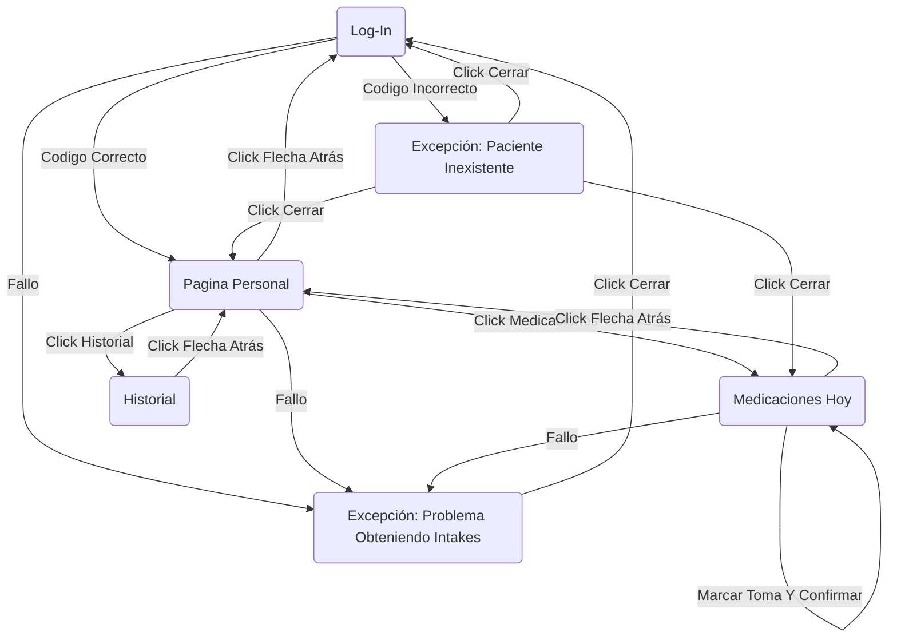

```mermaid
flowchart TD

    A("Log-In")
    B("Pagina Personal")
    C("Excepción: Paciente Inexistente")
    D("Medicaciones Hoy")
    E("Historial")
    F("Excepción: Problema Obteniendo Intakes")

A -- Codigo Correcto --> B
A -- Codigo Incorrecto --> C
A -- Fallo --> F

B -- Click Medicaciones --> D
B -- Click Historial --> E
B -- Click Flecha Atrás --> A
B -- Fallo --> F

C -- Click Cerrar --> A

D -- Marcar Toma Y Confirmar  --> D
D -- Click Flecha Atrás --> B
D -- Fallo --> F

E -- Click Flecha Atrás --> B

F -- Click Cerrar --> A
C -- Click Cerrar --> B
C -- Click Cerrar --> D
```

