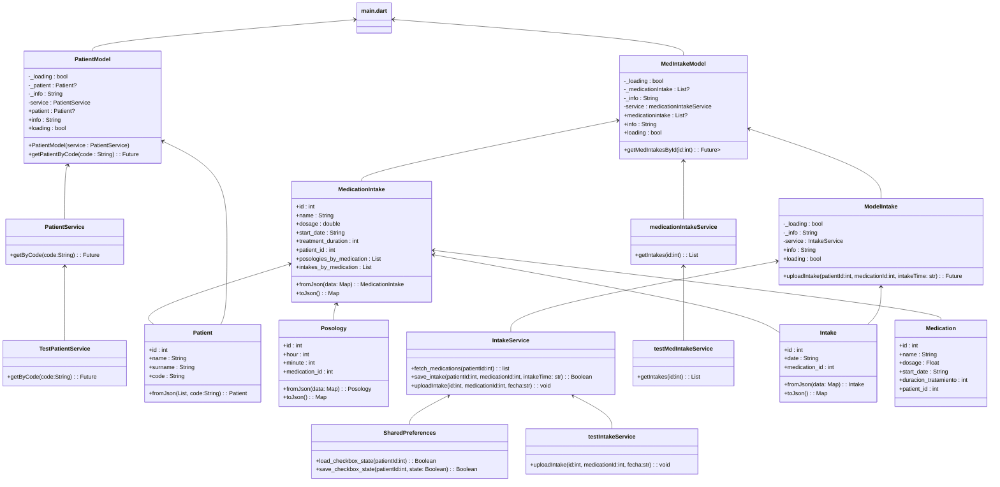

```mermaid
classDiagram

    class PatientModel {
        -_loading : bool
        -_patient : Patient?
        -_info : String
        -service : PatientService
        +patient : Patient?
        +info : String
        +loading : bool
        +PatientModel(service : PatientService)
        +getPatientByCode(code : String) : Future<Patient>
    }

    class PatientService{
        +getByCode(code:String) : Future<Patient>
    }

    class TestPatientService{
        +getByCode(code:String) : Future<Patient>
    }

    class Patient{
        +id : int
        +name : String
        +surname : String
        +code : String
        +fromJson(List<dynamic>, code:String) : Patient
    }

    class Posology{
        +id : int
        +hour : int
        +minute : int
        +medication_id : int
        +fromJson(data: Map<String, dynamic>) : Posology
        +toJson() : Map<String, dynamic>
    }

    class ModelIntake{
        -_loading : bool
        -_info : String
        -service : IntakeService
        +info : String
        +loading : bool
        +uploadIntake(patientId:int, medicationId:int, intakeTime: str) : Future<void>
    }

    class IntakeService{
        +fetch_medications(patientId:int) : list
        +save_intake(patientId:int, medicationId:int, intakeTime: str) : Boolean
        +uploadIntake(id:int, medicationId:int, fecha:str) : void
    }

    class testIntakeService{
        +uploadIntake(id:int, medicationId:int, fecha:str) : void
    }

    class medicationIntakeService{
        +getIntakes(id:int) : List<MedicationIntake>
    }

    class testMedIntakeService{
        +getIntakes(id:int) : List<MedicationIntake>
    }

    class SharedPreferences{
        +load_checkbox_state(patientId:int) : Boolean
        +save_checkbox_state(patientId:int, state: Boolean) : Boolean
    }

    class Intake{
        +id : int
        +date : String
        +medication_id : int
        +fromJson(data: Map<String, dynamic>) : Intake
        +toJson() : Map<String, dynamic>
    }

    class Medication{
        +id : int
        +name : String
        +dosage : Float
        +start_date : String
        +duracion_tratamiento : int
        +patient_id : int
    }

    class MedicationIntake{
        +id : int
        +name : String
        +dosage : double
        +start_date : String
        +treatment_duration : int
        +patient_id : int
        +posologies_by_medication : List<Posology>
        +intakes_by_medication : List<Intake>
        +fromJson(data: Map<String, dynamic>) : MedicationIntake
        +toJson() : Map<String, dynamic>
    }

    class MedIntakeModel{
        -_loading : bool
        -_medicationIntake : List<MedicationIntake>?
        -_info : String
        -service : medicationIntakeService
        +medicationintake : List<MedicationIntake>?
        +info : String
        +loading : bool
        +getMedIntakesById(id:int) : Future<List<MedicationIntake>>
    }

    class main.dart{

    }

    main.dart <-- MedIntakeModel
    main.dart <-- PatientModel

    PatientModel <-- PatientService
    PatientService <-- TestPatientService
    ModelIntake <-- IntakeService
    IntakeService <-- SharedPreferences
    IntakeService <-- testIntakeService

    MedIntakeModel <-- MedicationIntake
    MedicationIntake <-- Posology
    MedicationIntake <-- Intake
    MedicationIntake <-- Patient
    MedicationIntake <-- Medication
    MedIntakeModel <-- ModelIntake

    ModelIntake <-- Intake

    MedIntakeModel <-- medicationIntakeService
    medicationIntakeService <-- testMedIntakeService
    PatientModel <-- Patient


```
