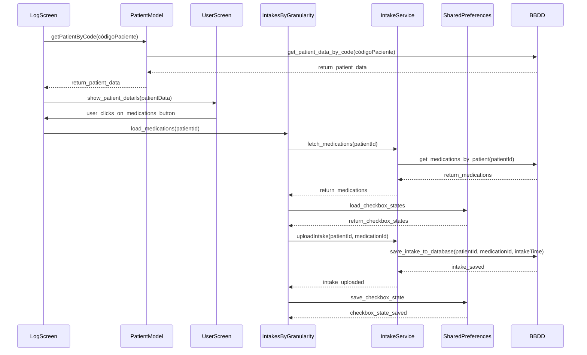

```mermaid
sequenceDiagram
  participant LogScreen as LogScreen
  participant PatientModel as PatientModel
  participant UserScreen as UserScreen
  participant IntakesByGranularity as IntakesByGranularity
  participant IntakeService as IntakeService
  participant SharedPreferences as SharedPreferences
  participant BBDD as BBDD

  %% Flujo de inicio - Logueo
  LogScreen ->> PatientModel: getPatientByCode(códigoPaciente)
  PatientModel ->> BBDD: get_patient_data_by_code(códigoPaciente)
  BBDD -->> PatientModel: return_patient_data
  PatientModel -->> LogScreen: return_patient_data

  %% Mostrar la pantalla de usuario y navegar a medicaciones
  LogScreen ->> UserScreen: show_patient_details(patientData)
  UserScreen ->> LogScreen: user_clicks_on_medications_button
  LogScreen ->> IntakesByGranularity: load_medications(patientId)

  %% Cargar Medicaciones
  IntakesByGranularity ->> IntakeService: fetch_medications(patientId)
  IntakeService ->> BBDD: get_medications_by_patient(patientId)
  BBDD -->> IntakeService: return_medications
  IntakeService -->> IntakesByGranularity: return_medications

  %% Cargar estados previos
  IntakesByGranularity ->> SharedPreferences: load_checkbox_states
  SharedPreferences -->> IntakesByGranularity: return_checkbox_states

  %% Marcar toma de medicación
  IntakesByGranularity ->> IntakeService: uploadIntake(patientId, medicationId)
  IntakeService ->> BBDD: save_intake_to_database(patientId, medicationId, intakeTime)
  BBDD -->> IntakeService: intake_saved
  IntakeService -->> IntakesByGranularity: intake_uploaded

  %% Guardar estados en SharedPreferences
  IntakesByGranularity ->> SharedPreferences: save_checkbox_state
  SharedPreferences -->> IntakesByGranularity: checkbox_state_saved
```
